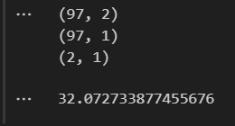
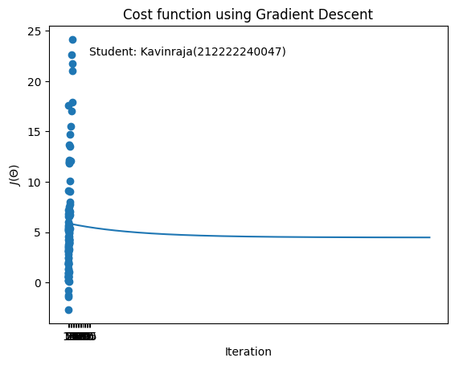

# Implementation-of-Linear-Regression-Using-Gradient-Descent

## AIM:
To write a program to predict the profit of a city using the linear regression model with gradient descent.

## Equipments Required:
1. Hardware – PCs
2. Anaconda – Python 3.7 Installation / Jupyter notebook

## Algorithm
1.Import the required library and read the dataframe.

2.Write a function computeCost to generate the cost function.

3.Perform iterations og gradient steps with learning rate.

4.Plot the Cost function using Gradient Descent and generate the required graph.

## Program:
```py
# Developed by: Kavinraja D
 #RegisterNumber:  212222240047

import pandas as pd
import numpy as np
import matplotlib.pyplot as plt
data=pd.read_csv("ex1.txt",header=None)
plt.scatter(data[0],data[1])
plt.xticks(np.arange(5,30,step=5))
plt.yticks(np.arange(-5,30,step=5))
plt.xlabel("Population of City(10,000s)")
plt.ylabel("Profit ($10,000)")
plt.title("Profit Prediction")

def computeCost(X,y,theta):
    m=len(y) 
    h=X.dot(theta) 
    square_err=(h-y)**2
    return 1/(2*m)*np.sum(square_err) 

data_n=data.values
m=data_n[:,0].size
X=np.append(np.ones((m,1)),data_n[:,0].reshape(m,1),axis=1)
y=data_n[:,1].reshape(m,1)
theta=np.zeros((2,1))
computeCost(X,y,theta) 

def gradientDescent(X,y,theta,alpha,num_iters):
    m=len(y)
    J_history=[] #empty list
    for i in range(num_iters):
        predictions=X.dot(theta)
        error=np.dot(X.transpose(),(predictions-y))
        descent=alpha*(1/m)*error
        theta-=descent
        J_history.append(computeCost(X,y,theta))
    return theta,J_history

theta,J_history = gradientDescent(X,y,theta,0.01,1500)
print("h(x) ="+str(round(theta[0,0],2))+" + "+str(round(theta[1,0],2))+"x1")

plt.plot(J_history)
plt.xlabel("Iteration")
plt.ylabel("$J(\Theta)$")
plt.title("Cost function using Gradient Descent")

plt.scatter(data[0],data[1])
x_value=[x for x in range(25)]
y_value=[y*theta[1]+theta[0] for y in x_value]
plt.plot(x_value,y_value,color="r")
plt.xticks(np.arange(5,30,step=5))
plt.yticks(np.arange(-5,30,step=5))
plt.xlabel("Population of City(10,000s)")
plt.ylabel("Profit ($10,000)")
plt.title("Profit Prediction")

def predict(x,theta):
    predictions=np.dot(theta.transpose(),x)
    return predictions[0]

predict1=predict(np.array([1,3.5]),theta)*10000
print("For Population = 35000, we predict a profit of $"+str(round(predict1,0)))

predict2=predict(np.array([1,7]),theta)*10000
print("For Population = 70000, we predict a profit of $"+str(round(predict2,0)))
```

## Output:
### Profit prediction:


### Function output:



### Gradient descent:

### Cost function using Gradient Descent:



### Linear Regression using Profit Prediction:


### Profit Prediction for a population of 35000:


### Profit Prediction for a population of 70000 :


## Result:
Thus the program to implement the linear regression using gradient descent is written and verified using python programming.
